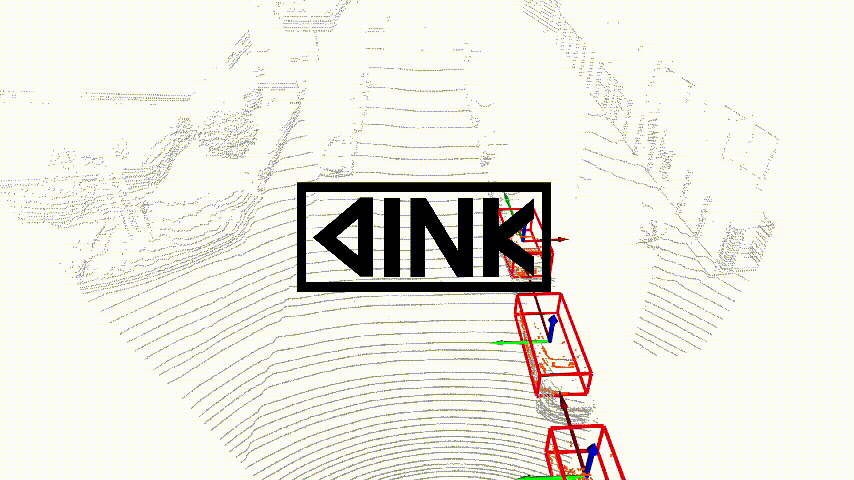

# DINK V0.2
🚕点云深度学习框架|Point Cloud Deep learning Framework🚕

DINK是一个点云深度学习框架，兼并SOTA深度学习算法与传统算法，一键运行并模拟,一键训练评估深度学习模型。

运行演示 http://fp-ai.com/video_details.html?id=7f39f8317fbdb1988ef4c628eba02591

安装演示 http://fp-ai.com/video_details.html?id=072b030ba126b2f4b2374f342be9ed44

更多内容请访问DINK官网 http://fp-ai.com

# [DINK下载安装|DINK INSTALL](https://github.com/FPAI/DINK/wiki/HOME)

# DINK三大特点：

1.兼并SOTA深度学习算法与传统算法，一键运行模拟。

2.DINK中人工智能纯Tensorflow实现。
  
3.全流程模块协同，CUDA加速。

# DINK两步安装：

1.安装Nvidia Docker。

2.下载运行DINK镜像。

***

DINK is a deep learning point cloud framework. It combines SOTA in-depth learning algorithm with traditional algorithm and runs simulation with one key.

run demonstration http://fp-ai.com/video_details.html?id=7f39f8317fbdb1988ef4c628eba02591

install demonstration http://fp-ai.com/video_details.html?id=072b030ba126b2f4b2374f342be9ed44

More content display on http://fp-ai.com

# DINK 3 main features:

1.Integrating SOTA deep learning algorithm and traditional algorithm, one-click operation simulation.

2.In DINK, artificial intelligence is made of pure Tensorflow.
  
3.Full process module collaboration, CUDA acceleration

# DINK two-step installation:

1.Install Nvidia Docker.

2.Download and run DINK mirror.

***

太平洋AI，TensorFlow源码贡献者人工智能团队，底层技术驱动上层应用，垂直领域规模化落地。底层框架降低人工智能开发门槛，帮助开发者应用落地，推动中国人工智能发展。

Pacific AI, the AI team of TF source contributors, the bottom technology drives the upper application, and the vertical field is landed on a large scale. 

官网|Official website： http://fp-ai.com

联系电话|Contact number： 400-153-0988

商务邮箱|Business email： info@fp-ai.com
